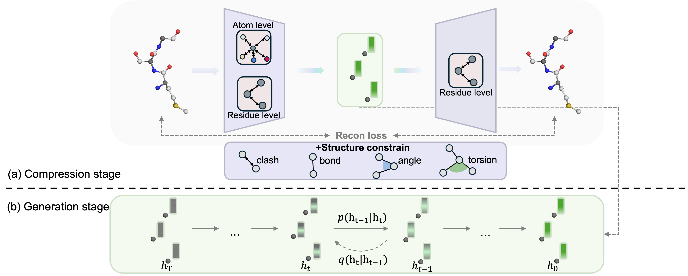

# CODLAD: Efficient Protein Backmapping via Constraint Decoupled Latent Diffusion

code & data for paper "Efficient Protein Backmapping via Constraint Decoupled Latent Diffusion"

[](https://doi.org/10.5281/zenodo.17461857)

## Overview

CODLAD: Constraint-Decoupled Latent Diffusion for Protein Backmapping
CODLAD is a novel two-stage framework for protein backmapping that leverages constraint-decoupled latent diffusion to reconstruct all-atom protein structures from coarse-grained representations. The framework consists of two main stages: 1) a compression stage that encodes atomic structures through hierarchical feature extraction while preserving structural constraints, and 2) a generation stage that performs diffusion in the compressed space where structural validity is inherently preserved. By separating structural constraints into the compression phase, CODLAD enables unconstrained generation in a simplified latent space, achieving state-of-the-art performance in both reconstruction quality and conformational diversity while significantly reducing computational costs compared to existing methods.



## Requirements

```bash
# 1. Clone the repository
git clone https://github.com/xiaoxiaokuye/CODLAD.git
cd CODLAD

# 2. Create and activate conda environment
conda create -n codlad python=3.11
conda activate codlad

# 3. Install dependencies
pip install -r requirements.txt

Note:
CUDA 12.1 is required
The code has been tested with Python 3.11
```

## Datasets

For PDB and PED datasets, and the checkpoint file, you can download them from our Google Drive:
[Download Link](https://drive.google.com/file/d/1xTb-LKYvTt9HrQW5RLwzL-MShbg0PSy7/view?usp=drive_link)


After downloading, 
for model checkpoints:
1. Place the "results" directory in the CODLAD root directory

for data:
1. Place PDB data files into `datasets/protein/PDB/`
2. Place PED data files into `datasets/protein/PED/`

For Atlas dataset preparation, please follow the steps below:
```bash
# 1. Navigate to scripts directory 
cd scripts

# 2. Execute download script
bash download_atlas.sh

# 3. Move data to correct location
mv [downloaded_directory_name] atlas_data
mv atlas_data ../datasets/protein/Atlas/
```

## 1.Vae section

vae section compress the all-atom structure to coarse-grained structure.

First of all, we need to preprocess the original data

- for dataset propress

  ```shell
  python extract_features.py \
      --process_data \
      --dataname PED # Atlas or PDB
  ```

Then we read the parameters to train the compression model

- for training

  ```shell
  python train_vqvae.py -load_json ./scripts/Vae_vqvae_PED_ns36_vq3_vq4096.json
  ```

- for inference

  ```shell
  python test.py \
      --backbone mpnn_diffusion \
      --vae_type N6 \ 
      --num_sampling_steps 100 \
      --experiment recon \
      --data_type PED \
      --num_ensemble 10  # N6 for PED, K3 for PDB, K4 for Atlas
  ```

## 2.Latent diffusion section

- for dataset propress

  ```shell
  python extract_features.py \
      --extract_features \
      --data-path ./datasets/preproccess_PED \
      --features-path ./datasets/features_N6 \
      --vae_type N6 \
      --dataname PED
  ```

- for training

  ```shell
  accelerate launch --multi_gpu \
      ./train_latent.py \
      --lr 3e-4 \
      --warmup 80000 \
      --schedule_step 1200000 \
      --final_lr 1e-5 \
      --batch_size 128 \
      --model diffusion \
      --class_dropout_prob 0 \
      --latent_size 3 \
      --backbone mpnn_diffusion \
      --feature_path './datasets/features_N6' \
      --exp './Diff_PED_mpnnnew'
  ```

- for inference

  ``` shell
  python test.py \
      --exp "Diff_PED_mpnnnew" \
      --backbone mpnn_diffusion \
      --model diffusion \
      --cfg_scale 0.0 \
      --latent_size 3 \
      --vae_type N6 \
      --num_sampling_steps 100 \
      --experiment latent \
      --data_type PED \
      --num_ensemble 10 
  ```


